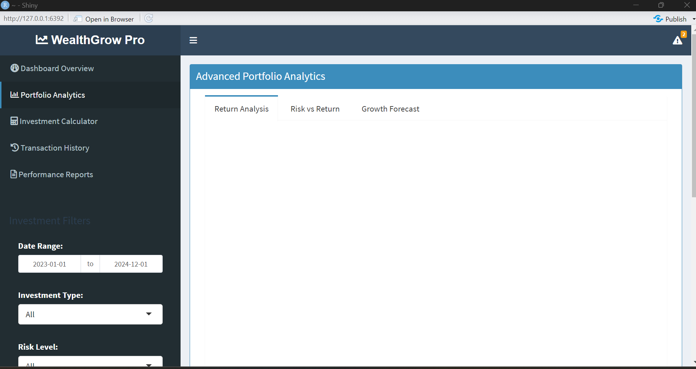

Advanced Features:

🚀 Professional Dashboard Structure
ShinyDashboard framework with sidebar and multiple tabs

Custom CSS styling with hover effects and animations

Value boxes for key metrics with icons

Notification system for alerts

📊 Advanced Analytics
Interactive Plotly charts with hover details

Multiple chart types: line, bar, pie, scatter plots

Real-time data filtering and reactive programming

Comparative analysis between investment types

💰 Investment Calculator
Compound interest calculations with monthly contributions

Interactive projections with customizable parameters

Visual growth forecasting with multiple scenarios

Detailed breakdown of contributions vs interest

📈 Portfolio Management
Risk analysis and distribution charts

Performance tracking over time

Portfolio allocation visualization

Transaction history with export capabilities

🎯 Professional Features
Report generation in multiple formats

Data export functionality (CSV, Excel, PDF)

Responsive design that works on all devices

Professional color scheme and branding

Images:

Dashboard Overview

Portfolio Analytics

Full Dashboard View

Investor Calculator

Transaction History

Additional Image

Deployment Ready:

# For deployment to shinyapps.io:

# 1. Install deployment package
# install.packages('rsconnect')

# 2. Set up account (one-time)
# rsconnect::setAccountInfo(
#   name = "your-account-name",
#   token = "your-token",
#   secret = "your-secret"
# )

# 3. Deploy application
# rsconnect::deployApp("path/to/your/app")

# 4. For RStudio: Click "Publish" button in Viewer pane